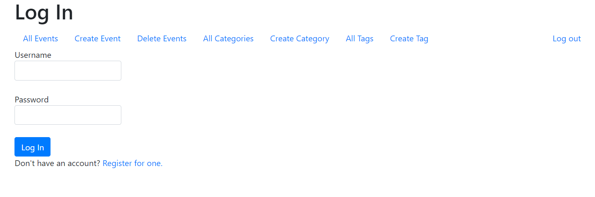
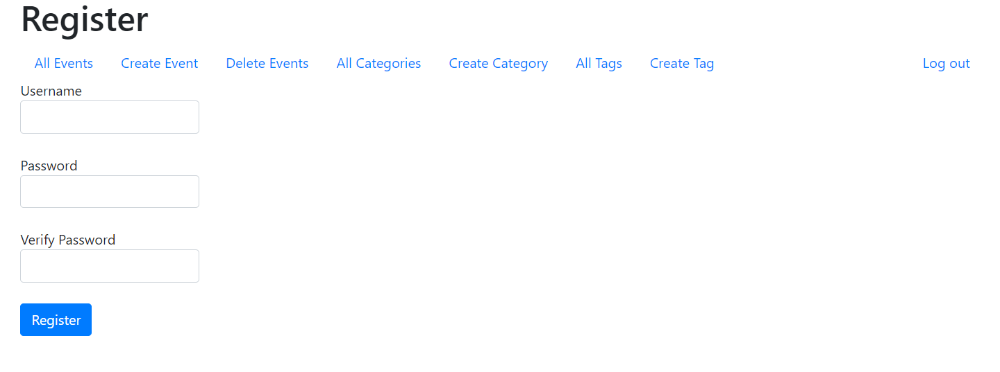
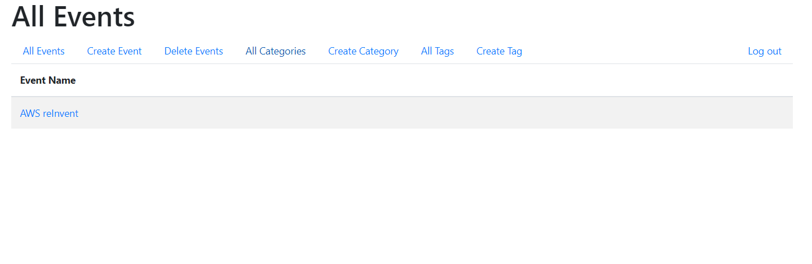
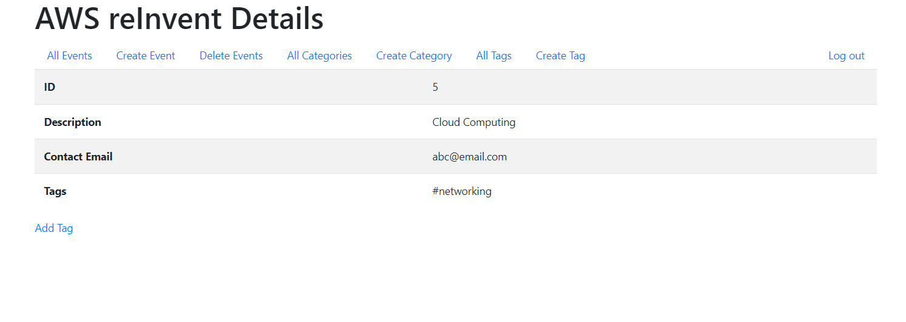
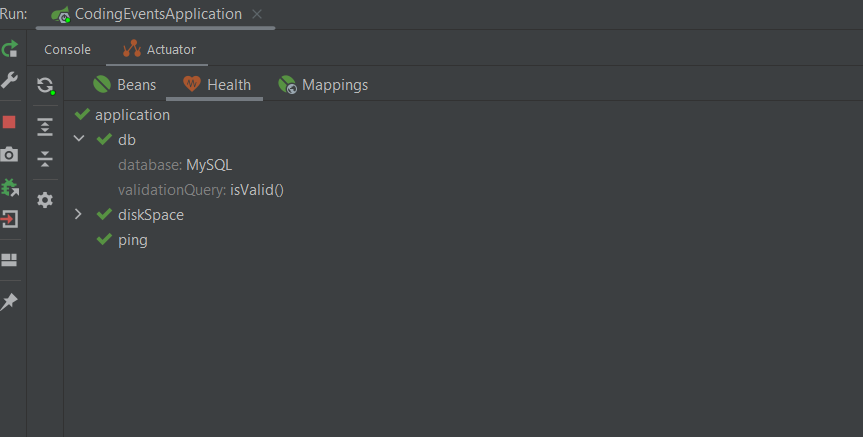

# Coding Events
This is an MVC application that keeps track of various coding events such as conferences, meetups etc.

It is a sample app that uses the Springboot framework, Thymeleaf and ORM

## Technologies
* Java
* Spring Boot
* Thymeleaf templates
* Hibernate
* MySQL Database
* Spring Actuator
* Bootstrap for styling

## Features
- User authentication
- Signed-in user can add new events, categories and tags
- Signed-in user can view events in a table
- User can open an individual event to see details
- User can delete events

## Running locally
* Fork this repo and clone it to your local machine
* Make sure you have Java installed on your local machine.
* [Set up MySQL on your local machine](https://ladvien.com/data-analytics-mysql-localhost-setup/)
* [Set up a persistent database for the application](https://education.launchcode.org/java-web-development/chapters/orm-part1/background.html#setting-up-a-persistent-database-video)
  * [For best practices, use environment variables to connect](https://education.launchcode.org/gis-devops/configurations/02-environment-variables-intellij/index.html)
* Start the server via **bootRun**
* Navigate to http://localhost:8080

## Screenshots of the app

If using IntelliJ IDEA - Ultimate, add the the Spring Actuator Dependancy to see health of the application

